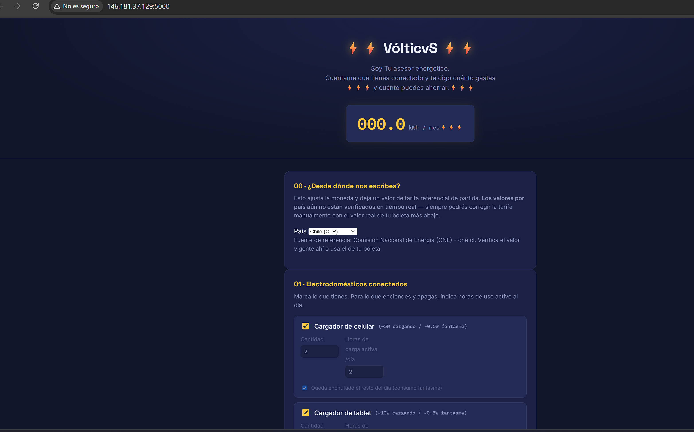
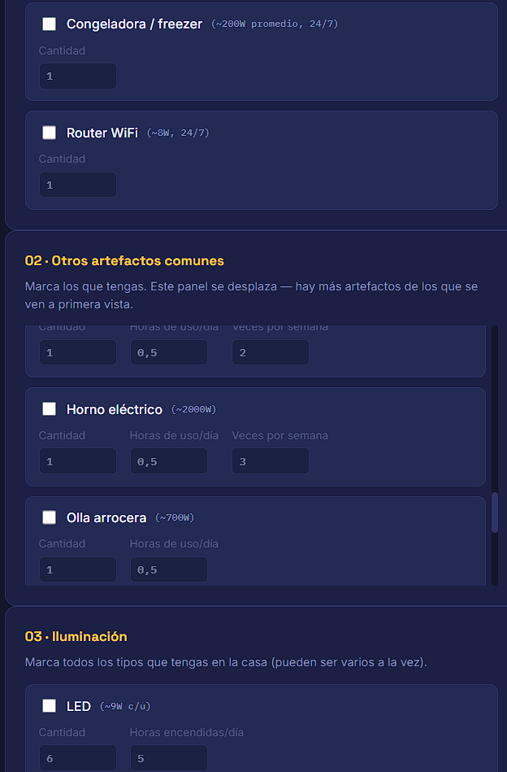

# VólticvS ⚡ — Asesor Energético con IA

Proyecto final del desafío **Alura Agente** (Oracle ONE G-9). Un agente conversacional
que actúa como asesor energético: pregunta sobre los artefactos e iluminación del hogar,
estima el consumo eléctrico mensual, calcula cuánto se puede ahorrar en pesos chilenos (CLP),
y proyecta ese ahorro en el tiempo — con recomendaciones que son realmente posibles de cumplir,
no solo matemáticamente correctas.

## 🌐 Aplicación en línea (OCI)

**URL pública:** http://146.181.37.129:5000

Desplegado en una instancia **Oracle Cloud Infrastructure Compute** (VM.Standard.E2.1.Micro,
Always Free, Ubuntu 24.04, región `sa-santiago-1`), corriendo como servicio `systemd`
(`asesor-energetico.service`) — persiste aunque se cierre la sesión SSH y se reinicia
automáticamente si el proceso llega a fallar.

**Capturas de la aplicación funcionando:**




## Arquitectura

El proyecto separa deliberadamente el **cálculo** de la **conversación**, y además separa
lo que es un consejo *matemáticamente correcto* de lo que es un consejo *realmente accionable*:

```
Usuario ──> Formulario HTML/CSS/JS  ──POST /api/calcular──>  Flask
     │                                                          │
     │ (o sube su boleta PDF)                    Motor de cálculo (Python puro, determinista)
     ▼                                                          │
/api/extraer-boleta ──> pdfplumber + regex           Filtro de recomendaciones realistas
  (detecta consumo/tarifa reales,                    (excluye "desconecta X" cuando X necesita
   requiere confirmación del usuario)                 energía constante para funcionar)
                                                                │
                                        Groq (Llama 3.3) redacta SOLO la narrativa final en
                                        párrafos, usando los números ya calculados (nunca los inventa)
                                                                │
                                        JSON de vuelta ──> JS anima el medidor, muestra
                                                            recomendaciones y proyección en el tiempo
```

- `app.py`: servidor Flask, expone `/`, `/api/calcular`, `/api/paises`, `/api/comparar` y
  `/api/extraer-boleta`.
- `templates/index.html`: formulario con selector de país, checklist de artefactos,
  iluminación (LED, incandescente, fluorescente, CFL, halógena, neón), CCTV, hervidor,
  subida de boleta PDF, y artefactos personalizados.
- `static/css/style.css`: identidad visual "medidor eléctrico" (fondo azul-tinta,
  acento amarillo-voltaje, números en fuente monoespaciada tipo display digital).
- `static/js/app.js`: arma el payload desde el formulario, llama al backend, anima
  el medidor de kWh, renderiza la narrativa en párrafos y la proyección en el tiempo.
- `src/calculos.py`: motor de cálculo determinista — consumo activo vs. standby/fantasma
  (configurable por ítem), frecuencia semanal de uso real (no asume uso diario), comparador
  de categorías de productos, y tarifas por país.
- `src/boleta.py`: extrae texto de la boleta PDF subida (`pdfplumber`) y detecta consumo (kWh)
  y monto total pagado con expresiones regulares, para calcular la tarifa real del usuario.
- `src/tools.py`, `src/agente.py`: versión CLI alternativa (chat de texto libre,
  LangChain + tool calling), útil para pruebas rápidas pero no es la interfaz principal.

**Por qué el LLM no calcula los números directamente:** los modelos de lenguaje no son
confiables para aritmética exacta. Todo el consumo y ahorro se calcula con funciones de
Python; el modelo solo redacta la narrativa final, en 2-3 párrafos, con los resultados
ya calculados.

**Por qué algunas recomendaciones se excluyen a propósito:** artefactos como el portón
eléctrico, las cámaras de seguridad, el DVR/NVR o el router WiFi necesitan estar siempre
energizados para cumplir su función (recibir la señal del control remoto, mantenerse en
red). El motor de cálculo sí detecta un "ahorro matemático" si se desconectaran, pero ese
consejo no es real ni seguro — por eso el generador de recomendaciones los excluye
explícitamente en vez de sugerir algo que rompería el aparato para el usuario.

## Ejemplos de uso

- Marcas "Cargador de celular", indicas 1 hora de carga activa al día, y decides si
  queda enchufado el resto del día (consumo fantasma) o no → VólticvS calcula el
  consumo real y el ahorro de desconectarlo cuando no lo usas.
- Marcas "Lavadora de ropa" con 3 veces por semana (no todos los días) → el cálculo ya
  no infla el consumo asumiendo uso diario.
- Subes el PDF de tu boleta eléctrica real → VólticvS detecta el consumo en kWh y el
  monto pagado, calcula tu tarifa real, y te deja confirmarla antes de aplicarla.
- Al terminar, ves recomendaciones en frases concretas (con ahorro mensual y anual), una
  proyección a 3 meses/6 meses/1 año/2 años/5 años, y puedes imprimir el informe completo
  con el botón que conecta directo con tu impresora.

## Cómo ejecutarlo localmente

1. Clonar el repositorio e instalar dependencias:
   ```bash
   python -m venv venv
   source venv/bin/activate  # En Windows: venv\Scripts\Activate.ps1
   pip install -r requirements.txt
   ```
2. Copiar `.env.example` a `.env` y agregar tu API key gratuita de
   [Groq](https://console.groq.com/keys):
   ```bash
   cp .env.example .env
   ```
3. Ejecutar la versión web (interfaz principal):
   ```bash
   python app.py
   ```
   Luego abre `http://127.0.0.1:5000` en el navegador.

4. (Opcional) Ejecutar la versión CLI de chat libre:
   ```bash
   python -m src.agente
   ```

## Alcance actual vs. roadmap (mirada de producto)

**Lo que funciona hoy (verificado, en producción):**
- Cálculo determinista de consumo/ahorro por artefacto, con separación explícita entre
  consumo activo y consumo fantasma/standby, y frecuencia de uso semanal configurable.
- Recomendaciones filtradas para que sean realmente accionables y seguras, no solo
  matemáticamente correctas.
- Proyección del ahorro en 5 plazos (3 meses, 6 meses, 12 meses, 2 años, 5 años).
- Subida de boleta eléctrica real (PDF) con detección de consumo y tarifa reales.
- Botón de impresión conectado al diálogo nativo de impresión del sistema operativo.
- Selector de país con tarifa referencial de partida (solo Chile tiene un valor
  precargado; el resto son placeholders a completar).
- Comparador de categorías de productos (arquitectura lista, catálogo de EJEMPLO).
- Deploy público 24/7 en OCI Compute, corriendo como servicio systemd.

**Decisiones de alcance deliberadas (y por qué):**
- **Comparador de productos con precios reales** (ej. aspiradoras/aires acondicionados
  de retailers reales): no implementado con datos reales. Requiere una API de shopping
  (de pago, o scraping con riesgo legal/técnico) para no inventar marcas, modelos o
  precios. Se dejó la arquitectura y un catálogo de ejemplo claramente marcado como tal,
  para conectar una fuente real más adelante.
- **Tarifas eléctricas oficiales en tiempo real** (ej. scrapear cne.cl): no implementado
  como scraping en vivo — en su lugar, se resolvió con la subida de boleta real (PDF),
  que es más confiable que un scraper frágil y le da al usuario su propio dato verificado.
- Ambas decisiones priorizan **no mostrar información falsa presentada como real**
  sobre completar la función a toda costa — importante para la credibilidad del agente.

## Estado del proyecto

- [x] Motor de cálculo determinístico (consumo activo/standby, frecuencia semanal por artefacto)
- [x] Interfaz web (Flask + HTML/CSS/JS) con checklist estructurado
- [x] Recomendaciones en frases concretas, filtradas para ser realmente accionables
- [x] Proyección de ahorro en el tiempo (3m/6m/1a/2a/5a)
- [x] Subida de boleta PDF con detección automática de consumo y tarifa (requiere confirmación)
- [x] Opción de imprimir informe de consumo y recomendaciones
- [x] Agente conversacional CLI alternativo (Groq + LangChain)
- [x] Deploy en OCI Compute (Always Free, systemd, acceso público 24/7)
- [ ] Formulario tipo wizard (una sección a la vez, estilo Google Forms) — próxima iteración
- [ ] Módulo de análisis de compra de equipos con datos reales — fuera del MVP actual
